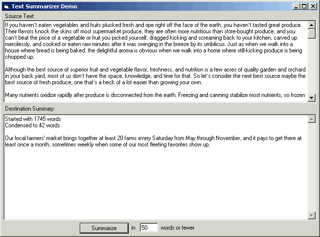



## Summary Generator \(demonstrates cool algorithm\)

### Description

Here's an easy-to-use utility that can take a chunk of plain text and generate a summary with up to a number of words you specify (e.g., 1000).

This code demonstrates an exceedingly cool algorithm I recently read about that basically works like this. Count all the occurrances of each word in the text. Score each sentence based mainly on how many of the most frequent words are in it (with a few other biases and ignoring dull words like "the"). Pick enough of the highest scoring sentences to meet the maximum word limit for the summary. Assemble these sentences into a summary.

Unbelievably simple, in theory. Not bad in practice, despite the fact that the engine doesn't really "understand" what it's summarizing. All it's doing is picking out the most "representative" sentences.

Included with this demo is an article from Seasoned Cooking magazine (seasoned.com). Try setting the maximum number of words to 100, 200, 300, and so on and see what you get. You can paste any text in you want. Be sure, though, that you help the engine out by putting one or more blank lines between any paragraphs, bullet points, etc.

Also, be aware that all periods are assumed to be end-of-sentence markers, even in abbreviations like "i.e.". This and a few other limitations make this algorithm imperfect, but still very illustrative of one kind of linguistic analysis engine.

I suspect this sort of code is unique on Planet Source Code, so I welcome and encourage your comments. Your vote is also appreciated.

----

 Recent Updates:

 8 November 2000: Engine improvement

 - Added a list of "hot words" to bias in favor of sentences with words like "key" and "important"

 9 July 2000: Engine improvements

 - Ignores words with few characters

 - Ignores topmost frequent words

 - Ignores lower half of infrequent words

 - Better bias towards beginning and end paragraphs
 
### More Info
 

             |
---                |---
**Submitted On**   |2000-11-08 08:13:42
**By**             |[James Vincent Carnicelli](https://github.com/Planet-Source-Code/PSCIndex/blob/master/ByAuthor/james-vincent-carnicelli.md)
**Level**          |Advanced
**User Rating**    |4.9 (68 globes from 14 users)
**Compatibility**  |VB 3\.0, VB 4\.0 \(16\-bit\), VB 4\.0 \(32\-bit\), VB 5\.0, VB 6\.0, VB Script, ASP \(Active Server Pages\) 
**Category**       |[Complete Applications](https://github.com/Planet-Source-Code/PSCIndex/blob/master/ByCategory/complete-applications__1-27.md)
**World**          |[Visual Basic](https://github.com/Planet-Source-Code/PSCIndex/blob/master/ByWorld/visual-basic.md)
**Archive File**   |[CODE\_UPLOAD114671182000\.zip](https://github.com/Planet-Source-Code/james-vincent-carnicelli-summary-generator-demonstrates-cool-algorithm__1-9615/archive/master.zip)

